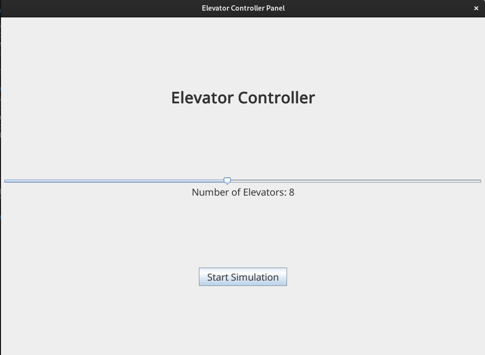

# Elevator System

Program do obsługi systemu wielu działających równolegle wind.

## Informacje ogólne
Aplikacja została napisana w języku ```Java 19``` z wykorzystaniem narzedzia do budowania projektów ```Maven```. 

## Uruchamianie aplikacji
W celu uruchomienia aplikacji należy wykonać z poziomu projektu polecenie:
```
mvn clean compile exec:java -e
```

Opcja ```-e``` pozwala na wyświetlenie informacji o ewentualnych problemach, które wystąpiły podczas uruchamiania programu.

## Opis działania

Zasada działania opiera się na algorytmie, który można podzielić na dwa poziomy.

### Poziom pierwszy - interfejs systemu wind

System wind ma za zadanie odbierać żądania z przycisków na poszczególnych piętrach i rozdzielać je pomiędzy dostępne windy. Przydział żądań składa się z trzech iteracji. Pierwsza z nich opiera się na następujących zasadach:
1. Jeżeli winda jest w stanie ```IDLE```, czyli stoi bezczynnie, to zostaje jej przydzielone dane żądanie
2. Jeżeli winda porusza się zgodnie z kierunkiem żądania (na przykład, gdy kierunek windy to ```UP``` oraz kierunek podany w żądaniu to ```UP```) oraz piętro żądania znajduje się "po drodze" windy (czyli w tym przykładzie jeżeli piętro windy jest mniejsze od piętra żądania), to zostaje jej przydzielone to żądanie 

Jeżeli po pierwszej iteracji żądanie nie zostanie przydzielone do żadnej z wind, to przechodzi ono do drugiej iteracji, w której każdej windzie poruszającej się w kierunku zgodnym z żądaniem, jest ono przydzielane. Jeżeli również po drugiej iteracji żądanie nie zostało wysłane do żadnej windy, to w trzeciej iteracji jest ono przypisywane do windy, której piętro docelowe znajduje się najbliżej piętra żądanego.

### Poziom drugi - interfejs pojedynczej windy

Pojedyncza winda ma dwa zadania:
1. Wykonywać żądania systemu
2. Przyjmować i wykonywać żądania wewnętrzne (podawane przez panel przycisków wewnątrz kabiny)

Oba typy żądań są dodawane do wspólnej listy, z której wybierany jest element minimalny za pomocą stworzonego w tym celu komparatora. Ustalony element minimalny jest przypisywany jako pierwsze żądanie do wykonania. 

Winda jedzie na wskazane piętro, otwiera drzwi i jeżeli lista żądań jest pusta oraz nie otrzyma kolejnego żądania, to przechodzi w tryb ```IDLE```. Informacja o spełnieniu żądania jest wysyłana do systemu, który przesyła dalej wszystkim windom informacje, żeby usunęły je ze swoich list, dzięki czemu będą one mogły wykonywać inne zadania. 

Wspomniany komparator (```RequestComparator```) jest klasą prywatną, która porównuje dwa żądania na podstawie wartości ich parametrów oraz aktualnego stanu windy. Porównanie opiera się na następujących zasadach:
1. Jeżeli winda jest w stanie ```IDLE```, wtedy lepszym żądaniem jest to, którego piętro znajduje się bliżej
2. Jeżeli winda porusza się w górę, to:
   1. Jeżeli jedno żądanie ma kierunek w górę, a drugie w dół, to lepsze jest to, które ma kierunek w górę
   2. Jeżeli oba mają kierunek w górę, wtedy lepsze jest to żądanie, którego piętro zostanie osiągnięte wcześniej przez windę (znajdujące się bliżej w górę)
3. Jeżeli winda porusza się w dół, to:
   1. Jeżeli jedno żądanie ma kierunek w górę, a drugie w dół, to lepsze jest to, które ma kierunek w dół
   2. Jeżeli oba mają kierunek w dół, wtedy lepsze jest to żądanie, którego piętro zostanie osiągnięte wcześniej przez windę (znajdujące się bliżej w dół)

## Struktura projektu

Projekt składa się z dwóch części:
1. Implementacji systemu wind (framework)
2. Prostej aplikacji graficznej pozwalającej na podstawową interakcję ze stworzonym systemem (wizualizacja)

### Framework

Pierwszą, a zarazem główną częścią projektu jest framework będący implementacją systemu umożliwiającego zarządzanie i obsługę wind.

#### Struktury danych

Stworzone rozwiązanie wykorzystuje następujące klasy będące strukturami danych:

##### Direction
Klasa ta jest enumeratorem, który może przyjmować trzy wartości:
1. ```UP``` - opisuje ruch windy w górę
2. ```DOWN``` - opisuje ruch windy w dół
3. ```IDLE``` - opisuje stan windy, w którym się nie porusza (nie wykonuje żadnego żądania lub ma otwarte drzwi)
   
##### Elevator State
Klasa stanu windy. Posiada ona cztery pola:
1. ```id``` - identyfikator windy (```int```)
2. ```currentFloor``` - aktualne piętro, na którym znajduje się kabina windy (```int```)
3. ```destinationFloor``` - piętro, do którego zmierza kabina windy (```int```)
4. ```direction``` - kierunek, w którym porusza się kabina windy (```Direction```)

##### Request
Klasa przedstawiająca żądanie do windy. Składa się z następujących pól:
1. ```floor``` - piętro, na które winda ma się udać (```int```)
2. ```direction``` - wstępnie zadeklarowany kierunek, w którym winda ma się udać z żądanego piętra (```Direction```)

#### Komparatory

Ze względu na potrzebę priorytetyzacji żądań, stworzono klasę, która je porównuje.

##### RequestComparator
Klasa komparatora jest prywatna i znajduje się w pliku ```Elevator.java```. Ma ona na celu porównywanie dwóch różnych żądań typu ```Request``` na podstawie stanu windy oraz pięter i kierunków żądań.

#### Interfejsy
W celu umożliwienia ewentualnego dalszego rozwoju stworzonego rozwiązania, część komponentów została opisana interfejsami, w celu łatwiejszej integracji.

##### IElevator
Interfejs opisujący pojedynczą instancję windy.
```
public interface IElevator {
    int getId();
    void update();
    void addRequest(Request request);
    void goTo(int floor);
    void removeRequest(Request request);
    List<Request> getRequests();
    void setCurrentFloor(int currentFloor);
    void setDestinationFloor(int targetFloor);
    void setDirection(Direction direction);
    int getCurrentFloor();
    int getDestinationFloor();
    Direction getDirection();
    boolean isDoorOpen();
    boolean isEnabled();
    void setEnability(boolean enability);
    ElevatorState getElevatorState();
}
```
Opis metod:
1. ```getId()``` - zwraca liczbę naturalną będącą identyfikatorem danej windy
2. ```update()``` - odpowiada za uaktualnianie stanu windy (otwieranie i zamykanie drzwi, poruszanie kabiną windy, sprawdzanie czy winda spełniła żądanie)
3. ```addRequest()``` - dodaje podane żądanie do listy żądań do wykonania
4. ```goTo()``` - podobnie jak poprzednia metoda, dodaje żądanie do listy (różni się argumentami oraz tym, że ta metoda obsługuje żądania wewnętrzne, a poprzednia zewnętrzne)
5. ```removeRequest()``` - usuwa podane żądanie z listy
6. ```getRequests()``` - zwraca kopię listy żądań
7. ```setCurrentFloor()```, ```setDestinationFloor()```, ```setDirection()``` - metody ustawiające wprost wartości parametrów windy
8. ```getCurrentFloor()```, ```getDestinationFloor()```, ```getDirection()``` - metody zwracające wartości parametrów windy
9. ```isDoorOpen()``` - metoda zwracająca ```true``` w sytuacji, gdy drzwi windy są otwarte oraz ```false``` w przeciwnym przypadku
10. ```isEnabled()``` - metoda zwracająca stan działania (włączenia) windy. ```true``` gdy winda działa, ```false``` gdy winda nie działa
11. ```setEnability()``` - metoda pozwala na wyłączenie lub włączenie windy
12. ```getElevatorState()``` - metoda zwraca stan windy (```ElevatorState```)

##### IElevatorSystem
Interfejs opisujący system zarządzający wieloma pracującymi równocześnie windami.
```
public interface IElevatorSystem {
    void addElevator(int id);
    int getNumberOfElevators();
    IElevator getElevator(int id);
    void removeElevator(int id);
    void disableElevator(int id);
    void enableElevator(int id);
    void pickup(int elevatorFloor, Direction direction);
    void update(int id, int currentFloor, int destinationFloor);
    void step();
    List<ElevatorState> status();
}
```
Opis metod:
1. ```addElevator()``` - metoda tworzy (dodaje) nową windę o podanym identyfikatorze
2. ```getNumberOfElevators()``` - metoda zwraca liczbę wszystkich wind w systemie
3. ```getElevator()``` - metoda zwraca obiekt typu ```IElevator```, który posiada podany identyfikator lub ```null``` w przeciwnym przypadku
4. ```removeElevator()``` - metoda usuwa obiekt windy o podanym identyfikatorze z systemu
5. ```disableElevator()```, ```enableElevator()``` - metody pozwalające na wyłączanie i włączanie windy o podanym identyfikatorze (na przykład w razie awarii)
6. ```pickup()``` - metoda przyjmuje żądanie i rozpoczyna jego obsługę
7. ```update()``` - metoda ustawia wprost podane parametry windy
8. ```step()``` - metoda wykonuje krok symulacji systemu wind
9. ```status()``` - metoda zwraca listę obiektów typu ```ElevatorState``` opisującą stany wszystkich wind w systemie


#### Klasa windy (```Elevator```)

Klasa ```Elevator.java``` implementuje interfejs ```IElevator```. Klasa jest odpowiedzialna za obsługę żądań zewnętrzych (```Request```) wysłanych przez system (```ElevatorSystem```) oraz za obsługę żądań wewnętrznych wysłanych z panelu przycisków w środku kabiny (metoda ```goTo(int floor)```). Winda samodzielnie wybiera żądanie, które zrealizuje jako pierwsze (korzystając z komparatora ```RequestComparator```). 

#### Klasa systemu wind (```ElevatorSystem```)
Klasa ```ElevatorSystem.java``` implementuje interfejs ```IElevatorSystem```. Klasa jest odpowiedzialna głównie za przyjmowanie żądań z paneli przycisków znajdujących się na poszczególnych piętrach, a następnie za rozdysponowywanie tych żądań (```Request```) do poszczególnych wind (```Elevator```). 


### Wizualizacja

Drugą częścią projektu jest jego wizualizacja w postaci aplikacji graficznej napisanej korzystając z biblioteki ```swing```.

#### Widok początkowy



Na pierwszym widoku (```ElevatorSystemView```) znajduje się suwak do określania liczby wind w systemie (z przedziału [1 ; 16] ) oraz przycisk umożliwiający start symulacji, po którego naciśnięciu uruchamia się nowe okno ```SimulationView```, który uruchamia i symuluje ```ElevatorSystem``` (ekran początkowy nie znika - można uruchomić wiele symulacji jednocześnie).

#### Widok symulacji


Widok symulacji jest podzielony na dwie kolumny:
1. Lewa - zawiera przyciski obsługi windy dla wszystkich pięter. Naciśnięcie któregoś z nich wysyła żądanie (```Request```) do systemu.
2. Prawa - zawiera informacje o każdej z wind w systemie. Od lewej:
   1. Nazwa i identyfikator windy
   2. Piętro na którym się znajduje
   3. Kierunek ruchu windy (początkowo wszystkie znajdują się w stanie ```IDLE``` na parterze)
   4. Docelowe piętro windy (w stanie ```IDLE``` piętro docelowe zawsze wskazuje na aktualne piętro)
   5. Przycisk ```Button Panel```, który uruchamia widok przycisków wewnątrz windy ```ButtonPanelView```.
   
Poniżej kolumn znajduje się przycisk ```Next Step```, który wysyła do systemu prośbę o wykonanie kolejnego kroku symulacji.

W przypadku, gdy drzwi którejś z wind są otwarte, jej tło zmienia kolor na zielony.


Można zauważyć, że gdy winda ma otwarte drzwi, jest w tymczasowym stanie ```IDLE``` na jeden krok symulacji, ponieważ winda nie może się poruszać z otwartymi drzwiami do kabiny.

W każdej zwizualizowanej symulacji występuje zawsze dokładnie jedenaście poziomów (10 pięter + parter). Jest to spowodowane łatwością wyświetlenia tej liczby rekordów w graficznym interfejsie użytkownika tej aplikacji. Należy podkreślić jednak, że framework nie ma podanych wprost żadnych ograniczeń związanych z liczbą poziomów obsługiwanych przez windy.

#### Widok panelu przycisków w kabinie


Widok przycisków w kabinie składa się z dwóch zasadniczych komponentów:
1. Nazwy i identyfikatora windy
2. Listy przycisków, których naciśnięcie powoduje dodanie wewnętrznego żądania do windy


